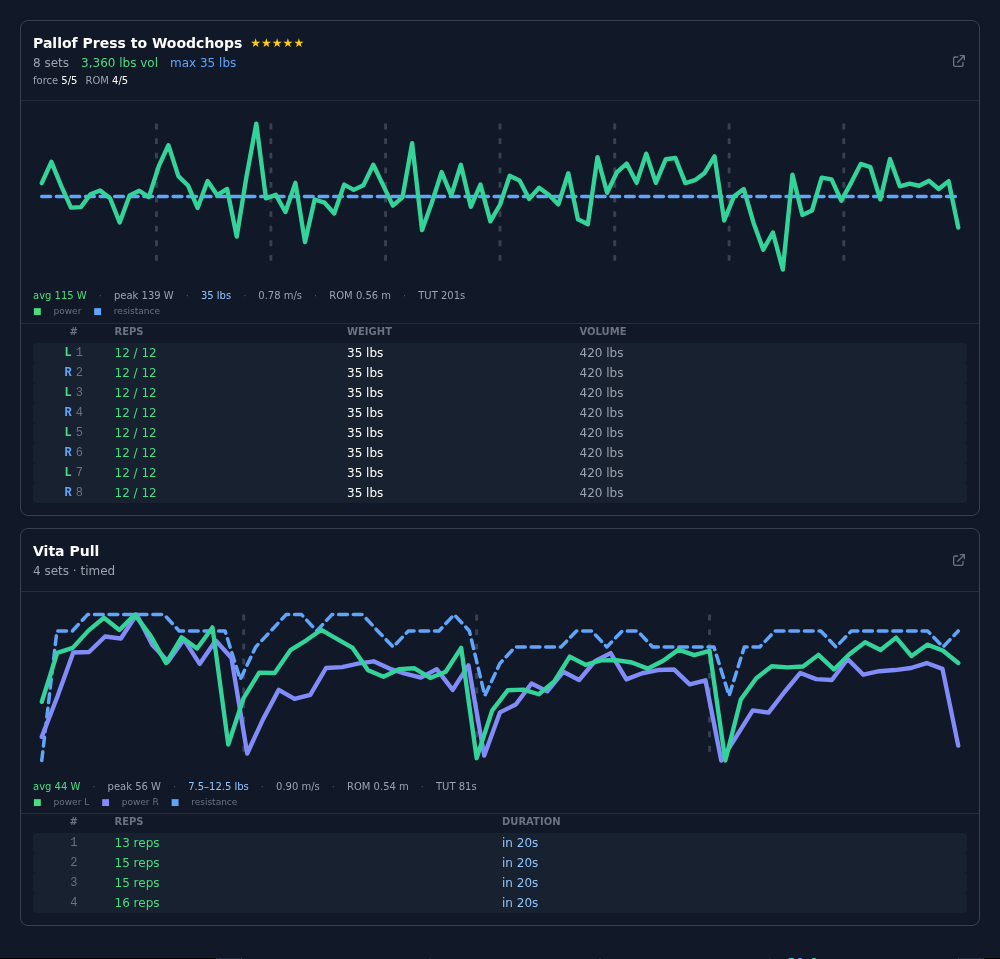
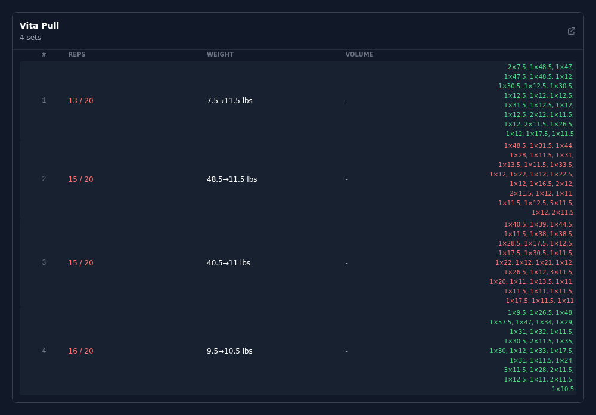
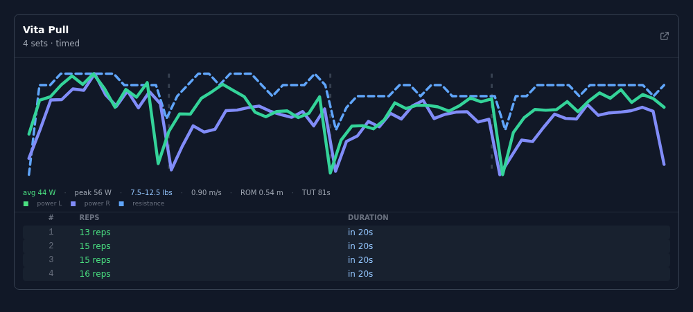

# Unofficial SmartGym Workout Manager

A desktop/web manager for the Speediance Gym Monster: browse the exercise library, build and
edit custom workouts, schedule them, generate workouts with an AI assistant, and review your
training history in far more detail than the official app exposes.

This fork exists to do two things:

1. **Get more insight out of your training.** The machine records a great deal about every
   rep you perform — power, speed, range of motion, time under tension, per-rep resistance,
   and its own form scores. Almost all of it was being fetched and thrown away. It is now
   charted and summarised.
2. **Keep working as Speediance ships new software.** The API gates newer content behind
   newer app versions. This client claimed to be an old release, so anything added to the
   machine after that release was either rejected outright or silently invisible — and
   several features were misreading the newer data models even once they loaded.

See **[CHANGELOG.md](CHANGELOG.md)** for the release notes and
**[docs/API-NOTES.md](docs/API-NOTES.md)** for the API's data model, including the traps that
caused the bugs fixed here.

---

## Notice from the Original Developer

> This project is being discontinued as Speediance is implementing security upgrades to their API infrastructure. Official alternatives for custom template management and desktop workflows are currently under development by the vendor's team.
> Thank you to everyone who contributed feedback, ideas, and support.

*— [hbui3](https://github.com/hbui3/UnofficialSpeedianceWorkoutManager)*

This fork may continue to function as long as the API remains accessible, but is subject to
the same limitations. Use at your own risk.

---

## Features

### Workout history and performance insight

- **Per-rep telemetry charts** — every rep of an exercise plotted in sequence, with dividers
  at set boundaries, so within-set fatigue and across-set decline read at a glance. Power is
  the solid line (split left/right when both cables are working); resistance is the dashed
  line. Rendered as inline SVG, no charting dependency.
- **Performance summary per exercise** — `avg 115 W · peak 139 W · 35 lbs · 0.78 m/s · ROM 0.56 m · TUT 201s`
- **Form scores** — the machine already computes force control, amplitude stability and
  left/right balance. They are now shown instead of discarded.
- **Personal-record badges** — surfaced when the machine flags a max-weight, 1RM, or volume PR.
- **Correct rendering of timed sets** — a timed set is a *seconds* window in which reps are
  counted. It now reads `15 reps in 20s` rather than `15 / 20`, and is judged on whether the
  window was held rather than against a rep target it never had.
- **Full history page** — all past workouts with date, duration, calories and exercise
  breakdown, exportable, with timestamps in your local timezone.



**Timed sets, before and after.** These four sets each ran a full 20 seconds. Previously they
were shown as failed rep targets, in red:

| Before | After |
|---|---|
|  |  |

### API compatibility with newer machine software

- **Current app version advertised** — the client previously announced an outdated version, and
  the API rejects newer content for old clients with
  `Error loading data: Please upgrade the APP version in System Setting`. Any workout
  containing a newer exercise refused to open, and those exercises were **silently missing
  from the library** — no error, just an incomplete list.
- **Structured API/auth/protocol exceptions**, reusable request sessions, better handling of
  Speediance API status codes, and optional environment-backed re-login.
- **API debug console** — a floating panel showing the last raw API request/response, for
  troubleshooting connection or data problems.

### Workout builder

- **Timed and level-based exercises handled correctly** — some exercises (the Vita movements,
  row/ski, and others) are scored by duration rather than reps, and some take an intensity
  *level* rather than a weight. The builder now reads the level from the right field, shows it,
  and no longer clamps it — a workout authored on the machine using levels 10/12/14/16 used to
  display as `0` and get crushed to a flat level 10 on save.
- **Live stats bar** — total exercises, estimated volume, total time, rest time, estimated burn.
- **Calorie estimate calibrated to you** — the estimate used to assume a 70 kg body weight and
  count only working time, ignoring rest entirely; on a real 75-minute session it read ~118 kcal
  against the 739 the machine recorded. The API exposes no body weight, so instead of guessing one
  the estimate is now calibrated against your own recorded sessions (your kcal/min is a remarkably
  stable personal constant). Falls back to the old formula if you have no history yet, and says
  which method it used.
- **Target Muscles radar chart** — visual breakdown of the muscle groups a workout covers.
- **Reordering** — move exercises up, down, to top or to bottom without repeated dragging.
- **Condensed exercise cards** — key stats on a single line per exercise.
- **Imperial / metric handling** — weights entered in Imperial are stored and retrieved without
  a spurious unit conversion; preset IDs (including `0`) are preserved rather than coerced to
  custom mode.

### AI workout generation

- **Exercise contracts made explicit in the prompt** — the generated prompt tags exercises the
  model cannot describe as plain reps-and-weight, and explains the rules:
  - `[TIMED]` / `[TIMED+LEVEL]` — the goal is a duration in **seconds**, not reps; and for
    level-based exercises the intensity is a **level** (stepping up across sets, e.g.
    10 → 12 → 14 → 16, is normal), not a weight or an RM value.
  - `[UNILATERAL]` — one set entry applies to **both** sides by default; a different load per
    side is opt-in via `"isUnilateralExpanded": true` with sets listed alternating Left, Right.
- **Preset selection is honoured** — the model's chosen preset used to be silently discarded and
  replaced with Custom, which meant an RM prescription was re-read as a raw weight.
- **Import/export round-trips faithfully** — exporting a timed workout no longer loses its
  seconds.

### Adaptive planner

- **Readiness-aware plan generation** (`adaptive_training.py`) — builds plans from normalised
  training signals, classifying days into build, maintain, recover or protect modes.
- **Single-implement sessions** — selects one implement per on-device workout (typically handles,
  barbell or rope).
- **On-device / off-device split** — keeps the on-device exercises in the machine payload and
  optionally adds accessories outside it.
- **Plan uniqueness window** — compares recent plan signatures so generated workouts do not
  repeat too quickly.
- **Payload conversion** — converts planner output into the `SpeedianceClient.save_workout`
  exercise contract.
- **Run and step guidance** — emits a run prescription and step target alongside the strength plan.
- **Preferred coach variant selection** — defaults unspecified exercise variants to a preferred
  coach when available, while preserving explicit manual choices.

### Scheduling and workouts list

- **Calendar** — schedule, move and remove custom workouts, with correct day highlighting
  regardless of timezone.
- **My Workouts** — count in the heading, reorganised and sorted for easier navigation.

---

## Setup

Copy the templates and fill them in — never commit the real files:

```bash
cp config.example.json config.json     # or use the Settings page to log in
cp .env.example .env
```

Install and run:

```bash
pip install -r requirements.txt
python app.py                          # http://localhost:5001
```

For a long-running deployment, serve the Flask app with a WSGI server rather than
`python app.py` (which enables the debug server). The app has **no authentication of its own**
and exposes your API token on the Settings page, so if you host it anywhere reachable, put an
authenticating reverse proxy in front of it.

### Docker

Edit the `volumes` path in `docker-compose.yml` to point at your checkout:

```yaml
volumes:
  - /path/to/your/app:/app
```

- **Windows example:** `/c/Users/yourname/Downloads/SmartGymWorkoutManager`
- **Linux / Synology NAS example:** `/volume1/docker/smart-gym-app`

```bash
docker compose up -d       # http://localhost:5001
```

---

## Running Tests

```bash
python3 -m unittest -v tests/test_unit.py tests/test_adaptive_training.py
node --test tests/workout-logic.test.mjs
```

`test_e2e_workouts.py` is credential-gated and skips when no Speediance credentials are
configured.

---

## What Is Intentionally Not Published

This repo should not contain:

- real `config.json` credentials
- `.env` files with secrets
- Speediance tokens or user IDs
- cached library payloads such as `library_cache*.json`
- workout exports, CSV files, logs, screenshots, databases, or personal fitness data
- private planner report outputs

Use `.env.example` and `config.example.json` as templates only. See
[PUBLICATION_SAFETY.md](PUBLICATION_SAFETY.md).

---

## Credit and Lineage

This is a personal fork, and no part of it is intended to take credit for — or create
confusion with — the projects it builds on.

- **[hbui3/UnofficialSpeedianceWorkoutManager](https://github.com/hbui3/UnofficialSpeedianceWorkoutManager)**
  — the original unofficial Speediance desktop manager: the core Flask app, the Speediance API
  client, login/config flow, settings UI, custom workout management, exercise and library
  screens, the workout-builder foundations, the prompt/export workflow, and the test scaffolding.
  Everything here rests on that work.
- **[ANPC86/SmartGymWorkoutManager](https://github.com/ANPC86/SmartGymWorkoutManager)** — the
  practical continuation that carried the project forward: workout-builder polish, the history
  and export work, calendar fixes, the debug console, Docker setup, imperial/metric handling,
  and regression coverage. Much of the feature list above originates here.
- **[clawdassistant85-netizen/speediance-smartgym-workout-manager](https://github.com/clawdassistant85-netizen/speediance-smartgym-workout-manager)**
  — the public publication copy this fork is based on, which added the adaptive planner, the
  structured auth/protocol error handling, and the publication-safety scaffolding.

This fork adds the workout-insight and API-compatibility work described above.
