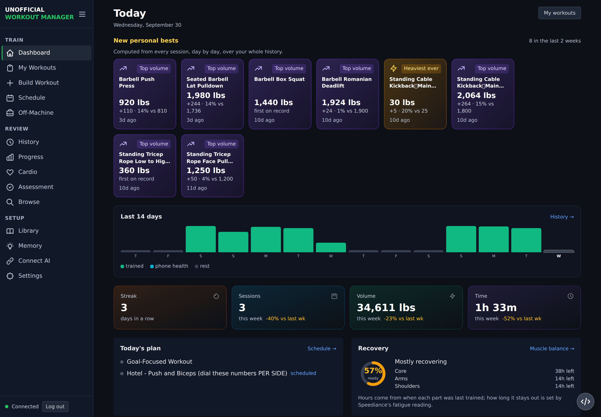
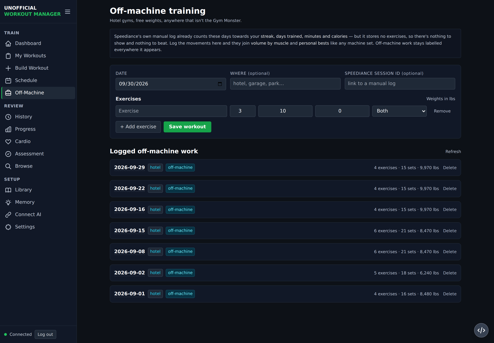
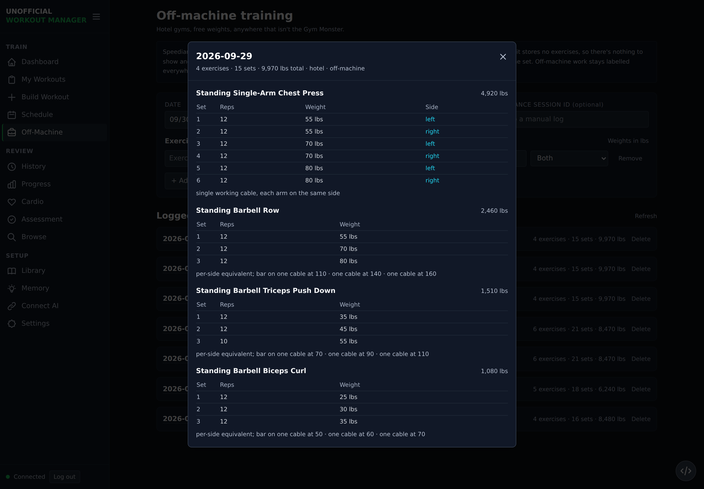
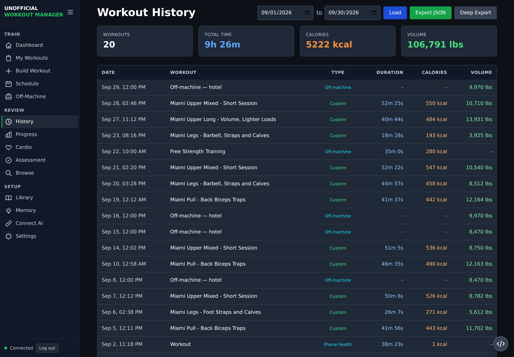
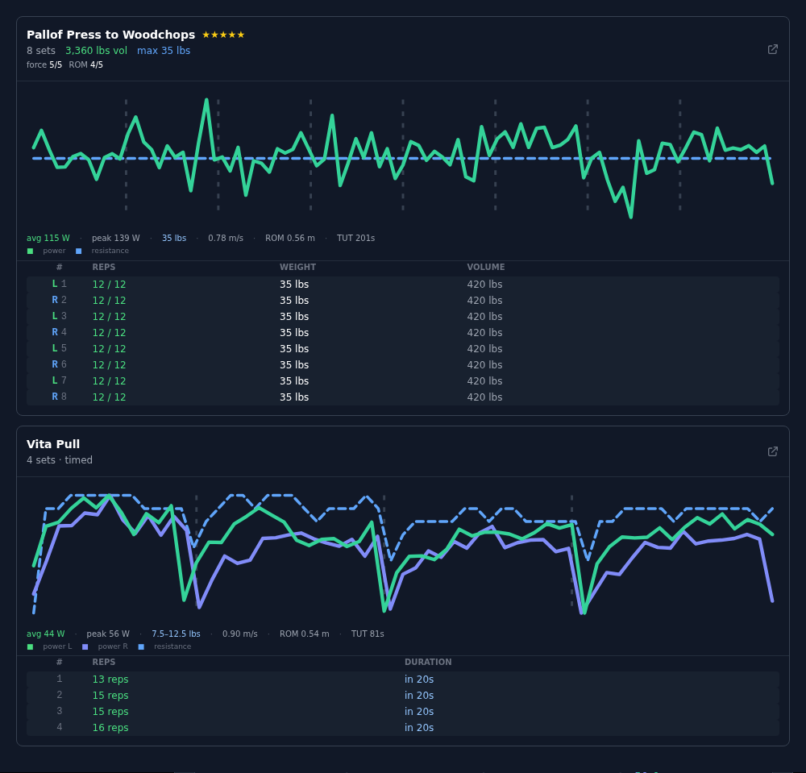
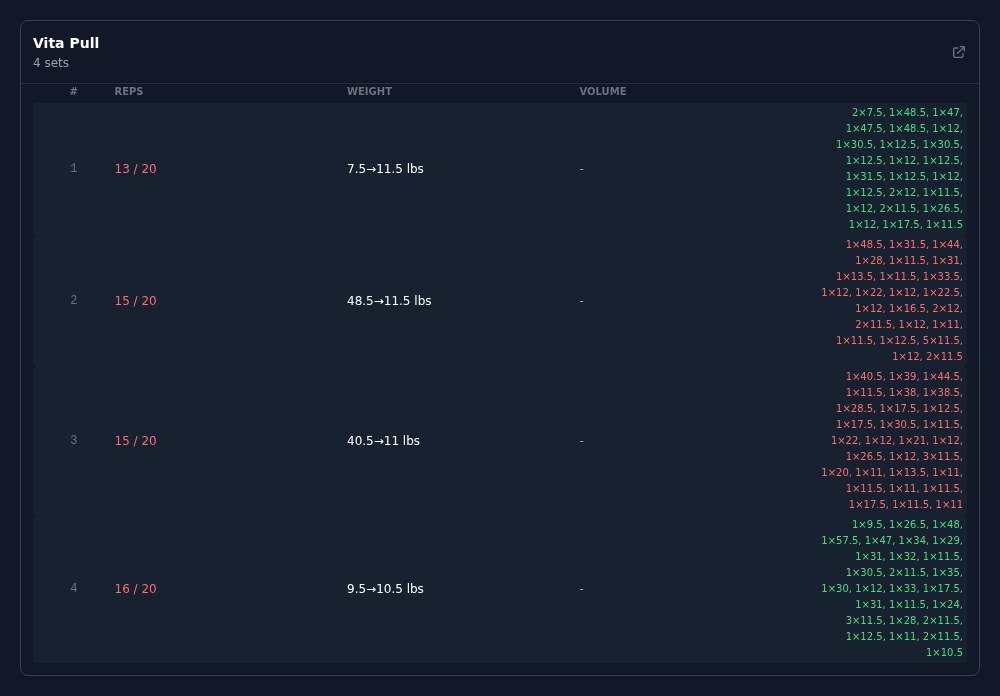
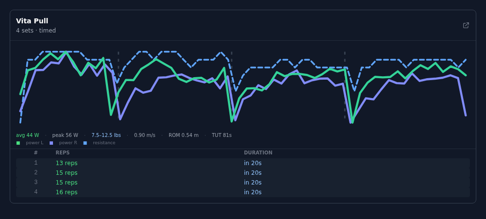

# Unofficial SmartGym Workout Manager

A desktop/web manager for the Speediance Gym Monster: browse the exercise library, build and
edit custom workouts, schedule them, generate workouts with an AI assistant, and review your
training history in far more detail than the official app exposes.

This fork exists to do two things:

1. **Get more insight out of your training.** The machine records a great deal about every
   rep you perform — power, speed, range of motion, time under tension, per-rep resistance,
   and its own form scores. Almost all of it was being fetched and thrown away. It is now
   charted and summarised.
2. **Keep working as Speediance ships new software.** The API gates newer content behind
   newer app versions. This client claimed to be an old release, so anything added to the
   machine after that release was either rejected outright or silently invisible — and
   several features were misreading the newer data models even once they loaded.

See **[CHANGELOG.md](CHANGELOG.md)** for the release notes and
**[docs/API-NOTES.md](docs/API-NOTES.md)** for the API's data model, including the traps that
caused the bugs fixed here.

> **Unofficial.** Not affiliated with or endorsed by Speediance. It uses the private API behind
> the Speediance app, which can change without notice. Use at your own risk.



---

## Features

### Dashboard

The landing page answers "what should I do today, and what happened lately" without opening
four tabs.

- **Streak and week-at-a-glance** — consecutive training days, plus sessions, volume, time and
  calories against the previous seven days. Deltas only appear when there is a baseline to
  compare against: "no data last week" is not "no change".
- **14-day activity strip** — every day drawn, because a rest day is part of the pattern, not
  missing data. Bar height is that day's share of the window's biggest. Machine sessions,
  off-machine days and phone-health activity are distinguished.
- **Personal bests** — heaviest weight and best-day volume, each card showing the number *and
  what it beat*, because "1,210 lbs" alone says nothing about whether it was hard-won.
  Computed from every session, day by day, over your whole history — see below for why that
  is harder than it sounds.
- **Muscle recovery** — which body parts are still recovering and roughly how long is left,
  from Speediance's per-muscle fatigue read combined with when each part was last loaded.
- **Today's plan and recent sessions**, each linking through to its own page.

#### Why personal bests are computed the hard way

Speediance's per-movement stat feed (`userActionStatPage`) looks daily — each row carries a
real date — but it is **weekly**. Every `dayStr` is the Monday of a Sunday-to-Saturday week,
so two sessions in one week are summed into a single row dated that Monday. Reading those rows
as days produced a dashboard card reading *"3,600 lbs, +107% vs 1,740, yesterday"* when the
real day was 1,800, up 3%.

There is no daily variant of that route, so per-day numbers can only come from each session's
own detail. Fetching all of it on every page load cost ~15 API calls and about three seconds,
and bounded records to whatever window was worth paying for. So each session's per-exercise
volume and top weight is derived once and cached locally: a load is now one API call and about
0.2s, and records cover your whole history.

The cache is a **derived** store, never a source of truth — every row is recomputable from
Speediance, so a bad one is fixable by rebuilding. A weekly cron keeps it honest: it fills
gaps, drops sessions you deleted in the app so they stop setting records, and re-derives
everything if the volume logic changes. See
[docs/session-stats-cron.md](docs/session-stats-cron.md).

### Off-machine training

Training away from the Gym Monster — hotel gyms, free weights, a garage rack — counts here.

Speediance's own manual log makes the day count towards your streak, days trained, minutes and
calories, but it stores **no exercises**, and they cannot be pushed in: the session-save route
is an update into a row the machine itself creates, so a workout that never ran on the hardware
cannot be written at all. The exercise detail therefore lives in your own store.



- **Log a session at `/offmachine`** — enter it the way you'd write it down ("3 × 10 @ 40") and
  it expands to one record per set. Backdating is fine, so a whole trip can be caught up at once.
- **Movements resolve to the Speediance library**, which is what lets a hotel dumbbell press
  count towards volume-by-muscle and set a personal best exactly like a machine set. A movement
  Speediance doesn't stock is still logged, and flagged as unattributable rather than dropped.
- **Counted everywhere it should be** — streak, days trained, the activity strip, week totals,
  volume by muscle, personal bests, and as its own row in History with a per-set breakdown.
- **Always labelled.** Off-machine work is never passed off as machine data; a day trained both
  ways reads as "machine + off-machine".
- **Unilateral sets are not doubled**, and bodyweight work is recorded rather than refused.

Click a date to see exactly what was done, set by set:



In History, off-machine days sit in date order alongside machine sessions — and a day you also
logged in the Speediance app appears once, not twice:



### Workout history and performance insight

- **Per-rep telemetry charts** — every rep of an exercise plotted in sequence, with dividers
  at set boundaries, so within-set fatigue and across-set decline read at a glance. Power is
  the solid line (split left/right when both cables are working); resistance is the dashed
  line. Rendered as inline SVG, no charting dependency.
- **Performance summary per exercise** — `avg 115 W · peak 139 W · 35 lbs · 0.78 m/s · ROM 0.56 m · TUT 201s`
- **Form scores** — the machine already computes force control, amplitude stability and
  left/right balance. They are now shown instead of discarded.
- **Personal-record badges** — surfaced when the machine flags a max-weight, 1RM, or volume PR.
- **Correct rendering of timed sets** — a timed set is a *seconds* window in which reps are
  counted. It now reads `15 reps in 20s` rather than `15 / 20`, and is judged on whether the
  window was held rather than against a rep target it never had.
- **Full history page** — all past workouts with date, duration, calories and exercise
  breakdown, exportable, with timestamps in your local timezone.
- **Cardio and rowing session stats** — cardio/rowing workouts in the history detail
  modal show a stats panel (distance, avg pace /500m, speed, power, calories burned,
  cal/min, energy, completion %, RPE, duration) and a cross-session trend chart with a metric
  switcher and the current session highlighted. Cached per-session, extensible via
  `CARDIO_COURSE_TYPES` in `cardio_stats.py` for new course types (bike, ski). Note:
  within-session per-second graphs are not available due to API endpoint limits.



**Timed sets, before and after.** These four sets each ran a full 20 seconds. Previously they
were shown as failed rep targets, in red:

| Before | After |
|---|---|
|  |  |

### Training journal and an optional AI coach

- **Session snapshot + how it felt** — each completed session records a factual snapshot
  (completion, per-set load or Vita level, ROM trend, the device's own force/amplitude/balance
  scores) alongside your own **felt rating**: an overall "how hard was today", plus an optional
  rating per exercise. Any, all, or none.
- **Compared over time and by muscle group** — the same workout lines up against its last
  outing (load deltas per exercise), rolled up by body region.
- **Facts, not a false oracle** — it deliberately does **not** hand down "add weight" verdicts
  from sensors alone. A power-only rule was tried and got it exactly backwards: it called an
  easy exercise "grinding" (one explosive rep skewed the maths) and a hard one "too light" (a
  small stabiliser burns without ever producing high wattage). A sensor cannot measure effort —
  your felt rating is the ground truth it misses, and the analysis code is unit-tested to never
  emit a verdict.
- **Optional coach, any provider** — a "Coach's read" button sends the *computed facts and your
  felt ratings* to the provider and model chosen for the Coach role and gets back a short read
  grouped by muscle group. Deterministic code produces every number; the model only interprets,
  under a prompt that forbids inventing figures and makes your felt rating outrank any metric.
  It speaks in *levels* for Vita, and recommends changes only where the evidence and your rating
  agree. Settings has a key row per provider (Anthropic, OpenAI, Google, Ollama, xAI Grok) —
  paste a key and **Test & load models** validates it and caches its model list — then the
  Coach picker chooses any provider and, once cached, any of its models, independently of the
  Workout Generator's own picker below. Ollama can point at the cloud (default) or a local
  daemon; keys are stored owner-only and never leave the machine except in the model call itself.
  - The read is **saved once generated** and shown instantly when you reopen the session
    (no re-billing the model), timestamped so a stale read is obvious — "Re-analyze" refreshes
    it after you change a rating.
  - The model's markdown is rendered to formatted HTML through an **escape-first** renderer, so
    the output is styled without ever letting the model's text inject markup.

### Multi-day performance assessment

- **Assessment page** (in the top nav) — pick a window of **1, 3, 7, or 14 days** and get one
  coach's read over *every* completed workout in that period: where you're **strong**, **weak**,
  **improving**, **regressing or plateauing**, where to **increase weight or resistance**, and
  other observations — grouped by muscle region.
- **Same facts, same guardrails, whole window** — it reuses the active AI provider and the exact
  per-exercise facts the single-session coach uses (each session laid out by date, oldest first),
  under an assessment prompt that keeps the same rules: cite only the given numbers, never invent,
  speak in *levels* for Vita, and let your **felt rating outrank** any sensor metric. Trends are
  judged only from the dated facts (a load or rep count rising across sessions is improvement;
  stalling with hard or failed sets is a plateau).
- **Cached, shown with its date** — the latest assessment is saved (owner-only, never committed)
  and shown instantly on return with when it was run and which model produced it, plus one-click
  buttons to run a fresh one over any window. The window is rolling, so it always tells you the
  date rather than pretending a cached read is current.

### API compatibility with newer machine software

- **Current app version advertised** — the client previously announced an outdated version, and
  the API rejects newer content for old clients with
  `Error loading data: Please upgrade the APP version in System Setting`. Any workout
  containing a newer exercise refused to open, and those exercises were **silently missing
  from the library** — no error, just an incomplete list.
- **Structured API/auth/protocol exceptions**, reusable request sessions, better handling of
  Speediance API status codes, and optional environment-backed re-login.
- **API debug console** — a floating panel showing the last raw API request/response, for
  troubleshooting connection or data problems.

### Workout builder

- **Timed and level-based exercises handled correctly** — some exercises (the Vita movements,
  row/ski, and others) are scored by duration rather than reps, and some take an intensity
  *level* rather than a weight. The builder now reads the level from the right field, shows it,
  and no longer clamps it — a workout authored on the machine using levels 10/12/14/16 used to
  display as `0` and get crushed to a flat level 10 on save.
- **Live stats bar** — total exercises, estimated volume, total time, rest time, estimated burn.
- **Calorie estimate calibrated to you** — the estimate used to assume a 70 kg body weight and
  count only working time, ignoring rest entirely; on a real 75-minute session it read ~118 kcal
  against the 739 the machine recorded. The API exposes no body weight, so instead of guessing one
  the estimate is now calibrated against your own recorded sessions (your kcal/min is a remarkably
  stable personal constant). Falls back to the old formula if you have no history yet, and says
  which method it used.
- **Target Muscles radar chart** — visual breakdown of the muscle groups a workout covers.
- **Reordering** — move exercises up, down, to top or to bottom without repeated dragging.
- **Condensed exercise cards** — key stats on a single line per exercise.
- **Imperial / metric handling** — weights entered in Imperial are stored and retrieved without
  a spurious unit conversion; preset IDs (including `0`) are preserved rather than coerced to
  custom mode.

### AI workout generation (in-app)

- **Describe it on the Build Workout page and it loads straight into the builder** — a
  "Generate Workout" box takes a plain description (e.g. "a short 20-minute back workout,
  4 exercises") and drops the result into the same builder used for manual workouts, so you
  review, edit, name and save it exactly as you would one you built by hand. This replaces the
  old **Generate Prompt** button, which only produced text to copy into an external AI chat and
  paste back as JSON. **Import JSON** remains, as a manual fallback.
- **Reference your own workouts** — **+ Add reference** opens a picker over your workout history;
  pick one or more and they show as chips next to the Generate box. The model gets a readable
  summary of each referenced workout and its exercises are made available to reuse, adapting sets
  and loads to your request and recent performance rather than copying them as-is.
- **Provider and model picked in Settings, independently of the coach** — the Workout Generator
  has its own picker covering all five providers (Anthropic, OpenAI, Google, Ollama, xAI Grok),
  reusing whichever per-provider keys are already saved; there is nothing extra to key in twice.
  Model dropdowns are populated from the cached list built by **Test & load models**, so
  switching providers shows every available model rather than just the one already saved.
- **Two-stage generation** — a cheap first pass reads only exercise names and narrows the full
  library down to a relevant pool for the request; a second pass then generates the actual
  workout from just that pool, which keeps the expensive call's context small and its exercise
  choices grounded in what the library actually has. A malformed response gets one repair retry
  before the generator gives up.
- **Loads follow your account's unit and are never converted** — the model is told whether the
  account is lb or kg and writes directly in it; nothing is converted after the fact, the same
  rule the coach's reads and the builder's Imperial/metric handling already follow.
- **Recent performance grounds the prescribed weights** — the request includes a per-exercise
  table of your recent lifts (last 30 days by default; a control next to the Generate box offers
  30/14/7 days or Off), and the model is told to set and progress weights from it instead of
  guessing: complete everything and it felt easy, progress the load; struggled or it felt hard,
  hold or reduce. Felt rating outranks the raw numbers.
- **Exercise contracts made explicit in the prompt** — exercises the model cannot describe as
  plain reps-and-weight are tagged, and the rules spelled out:
  - `[TIMED]` / `[TIMED+LEVEL]` — the goal is a duration in **seconds**, not reps; and for
    level-based exercises the intensity is a **level** (stepping up across sets, e.g.
    10 → 12 → 14 → 16, is normal), not a weight or an RM value.
  - `[UNILATERAL]` — one set entry applies to **both** sides by default; a different load per
    side is opt-in via `"isUnilateralExpanded": true` with sets listed alternating Left, Right.
- **Preset selection is honoured** — the model's chosen preset used to be silently discarded and
  replaced with Custom, which meant an RM prescription was re-read as a raw weight.
- **Import/export round-trips faithfully** — exporting a timed workout no longer loses its
  seconds.
- **Refine it by comment instead of regenerating** — once a workout is generated or imported into
  the builder, a **Refine with AI** panel takes a follow-up comment ("make leg day harder", "swap
  the squat for a hinge", "add a set to the rows") and adjusts the workout in place. Each round
  sends the current builder state plus the full comment log, so a later comment never undoes an
  earlier one or reverts manual edits made in between. Works with whichever of the five providers
  is picked for the generator.

### Avoided exercises

- **Mark any exercise "avoided," with an optional reason** — a ⊘ toggle on every Library
  card lets you avoid (or un-avoid) a movement in place, with an inline reason field (e.g.
  "shoulder pain") instead of a browser prompt. A "Show avoided: all / hide / only" filter
  on the Library, and an **Avoided exercises** card on Settings (name + reason + Remove),
  cover the two other places you'd want to see or clear the list.
- **The AI generator and refiner never suggest an avoided exercise** — both
  `/api/workout/generate` and `/api/workout/refine` drop avoided ids from the exercise
  catalog and from the candidate pool before the model ever sees them, and the system
  prompt gets an explicit "Never include these exercises: ..." line as a second guard.
- **The adaptive planner (`adaptive_training.py`) can skip them too, when asked** —
  `build_plan(signals, avoided_ids=...)` and its movement/off-Speediance selection
  helpers accept an `avoided_ids` set, unioned with the static `BLACKLIST`. Nothing in
  this Flask app currently calls `build_plan()` — it's a separate, standalone planning
  script bundled in this repo (reads its own hardcoded library-cache path, not this
  app's `config.json`) — so today it skips avoided exercises only if *its* caller
  passes `avoided_store.avoided_ids(avoided_store.db_path(...))` in; the plumbing to do
  so is in place for whichever caller wires it up.
- **Never blocks manual building** — adding an avoided exercise to the workout builder by
  hand (search/pick or import) still works; it just shows a "⊘ Marked avoided: &lt;reason&gt;"
  warning badge on that exercise's card.
- **Storage** — a small SQLite file at `~/.config/speediance-mcp/speediance-mcp.db`
  (table `exercise_marks`), shared with the speediance-mcp project: both apps read and
  write the same "avoided"/"preferred" marks, so a movement avoided here is avoided
  there too. Override the path with the `avoided_db_path` key in `config.json` if you'd
  rather point it elsewhere.

### Adaptive planner

- **Readiness-aware plan generation** (`adaptive_training.py`) — builds plans from normalised
  training signals, classifying days into build, maintain, recover or protect modes.
- **Single-implement sessions** — selects one implement per on-device workout (typically handles,
  barbell or rope).
- **On-device / off-device split** — keeps the on-device exercises in the machine payload and
  optionally adds accessories outside it.
- **Plan uniqueness window** — compares recent plan signatures so generated workouts do not
  repeat too quickly.
- **Payload conversion** — converts planner output into the `SpeedianceClient.save_workout`
  exercise contract.
- **Run and step guidance** — emits a run prescription and step target alongside the strength plan.
- **Preferred coach variant selection** — defaults unspecified exercise variants to a preferred
  coach when available, while preserving explicit manual choices.

### Scheduling

- **Repeating schedules** — Speediance itself has no recurrence; it only stores one workout per
  day. Define a pattern once and it is written out day by day, ~12 weeks ahead, and quietly
  topped back up whenever you open the app. No cron, no daemon.
  - **By weekday** — Monday is always Workout A. Miss a Wednesday and nothing shifts.
  - **Rotating cycle** — a sequence (A, B, C, rest) that repeats continuously and drifts across
    the calendar, for "3 on, 1 off" regardless of what day it is.
- **Preview before anything is written** — applying a schedule can remove existing entries, so it
  always shows you exactly what it will add, replace and clear first, **naming every entry that
  would be destroyed**. A count is not consent.
- **Your history is never touched** — completed sessions are left alone, as are Speediance's own
  "Goal-Focused Workout" suggestions. Only workouts you scheduled are managed.
- **Calendar** — schedule, move and remove custom workouts by drag and drop, with correct day
  highlighting regardless of timezone.
- **My Workouts** — count in the heading, reorganised and sorted for easier navigation.

("Create Plan" in the nav was renamed **Build Workout** — it builds a *workout*, not a training
plan, and the old name sent people looking for scheduling in the wrong place.)

### Wellness Project backfill

- **Automatic workout detail sync** — fills empty Wellness Project strength workouts from
  matching Speediance sessions by date and calorie estimate. One-time setup: open
  `/wp/reconcile` and click **Connect Wellness Project**; from then on the app maintains
  an OAuth token and runs refreshes automatically. Confident matches are applied
  immediately; ambiguous candidates are shown on the reconcile page for manual review.
- **Daily cron** — a scheduled scan runs every morning and applies any new confident matches
  from overnight Speediance sessions, idempotent (does nothing if an exercise set already
  has detail). Real-gym workouts created at Speediance (marked `@ Gym`) are never modified.
  See [docs/wp-backfill-cron.md](docs/wp-backfill-cron.md) for setup and the cron command.

---

## Companion project: speediance-mcp

**[speediance-mcp](https://github.com/labatt/speediance-mcp)** is a separate, free MCP server
that lets **Claude** read and manage the same training data — in Claude Desktop, Claude Code,
or on claude.ai. The two projects are independent and each works alone.

|  | This web app | speediance-mcp |
|---|---|---|
| Interface | Browser UI you click through | Conversation with Claude |
| Best at | Charts, the workout builder, scanning history, schedule grids | Asking questions, planning, "log what I did at the hotel" |
| Builds workouts | Visual builder + in-app AI generation | Claude creates and edits them for you |
| Personal bests | Dashboard cards, all-time, cached | — (no records tool) |
| Off-machine logging | `/offmachine` form | `log_off_machine_workout` in chat |
| Coaching memory | Avoided exercises | Full curated facts: injuries, goals, schedule, equipment |
| Runs as | A Flask site you host | A local process Claude launches, or a remote server |

**You can run either on its own.** Neither imports the other and neither calls the other over
the network.

**If you run both, they share one SQLite file** at
`~/.config/speediance-mcp/speediance-mcp.db`, so they can never disagree:

- Exercises you mark **avoided** in one are respected by the other.
- **Off-machine workouts** logged by Claude appear on this app's dashboard, history and
  personal bests immediately — and vice versa.
- Owned/unusable **equipment** and coaching preferences are shared.

Each project declares the shared tables identically and a test fails if the two definitions
ever drift. The web app is what populates the personal-best cache; the MCP server does not
need it and works fine without it.

> **Client types matter when running both.** Speediance allows one live session per *client
> type*, so point the two at different types — e.g. this app on `bike` and the MCP on `nano` —
> or signing in with one will sign the other out. See [Signing in](#signing-in) below.

---

## Setup

**Requirements:** Python 3.10+ and a Speediance account.

**1. Get the code and install dependencies** (a virtual environment keeps it off your system
Python):

```bash
git clone https://github.com/labatt/speediance-smartgym-workout-manager.git
cd speediance-smartgym-workout-manager
python3 -m venv .venv && source .venv/bin/activate   # Windows: .venv\Scripts\activate
pip install -r requirements.txt
```

**2. Create your config** — copy the templates and fill them in. **Never commit the real
files**; both are gitignored:

```bash
cp config.example.json config.json     # or just use the Settings page to log in
cp .env.example .env                   # only needed for the AI features
```

**3. Run it:**

```bash
python app.py                          # http://localhost:5001
```

Then open <http://localhost:5001>, go to **Settings**, and sign in — read
[Signing in](#signing-in) first, because the client type you choose decides whether you get
signed out of your phone or your machine.

**4. Optional — keep the personal-best cache current.** It fills itself as you use the app; a
weekly cron also catches sessions deleted in the Speediance app. See
[docs/session-stats-cron.md](docs/session-stats-cron.md).

For a long-running deployment, serve the Flask app with a WSGI server rather than
`python app.py` (which enables the debug server), and run a **single worker** — the app holds
one in-memory session, so multiple workers would disagree about whether you're logged in. The
app has **no authentication of its own** and exposes your API token on the Settings page, so if
you host it anywhere reachable, put an authenticating reverse proxy in front of it.

### Signing in

Speediance allows **one live session per client type**, not per account: every Speediance app and
machine signs in as a type, and a new sign-in with a type signs out whatever was using it. By
default this app signs in as the phone app, so signing in here logs your phone out, and vice
versa. The nav bar always shows the current state — a green dot when connected, a red
"Signed out" with a one-click Log in when not. Tick **Remember me** at login and the app
re-authenticates itself automatically when its token expires; your password is then stored in
`config.json` on this machine (owner-only) to make that possible, and "Forget it" in Settings
erases it.

To stop this app and your phone signing each other out, set `login_client_type` in
`config.json` to a slot no device of yours uses:

| `login_client_type` | Whose slot it is | Signing in with it signs out... |
|---|---|---|
| `phone` (default) | The Speediance phone app | your phone app |
| `gym-monster` | The Gym Monster | your Gym Monster — don't use this |
| `nano` | Gym Nano | a Gym Nano, if you own one |
| `bike` | Speediance bike | a Speediance bike, if you own one |

Most Gym Monster owners should use `bike` (or `nano` if they own a Speediance bike). With `nano`
or `bike`, a remembered password also re-signs in quietly if something else takes the slot. If you
run another Speediance tool on the same account, give it a different free slot. These types were
found by testing, aren't documented by Speediance, and could change.

### Docker

Edit the `volumes` path in `docker-compose.yml` to point at your checkout:

```yaml
volumes:
  - /path/to/your/app:/app
```

- **Windows example:** `/c/Users/yourname/Downloads/SmartGymWorkoutManager`
- **Linux / Synology NAS example:** `/volume1/docker/smart-gym-app`

```bash
docker compose up -d       # http://localhost:5001
```

---

## Running Tests

```bash
python3 -m unittest -v tests/test_unit.py tests/test_adaptive_training.py
node --test tests/workout-logic.test.mjs
```

`test_e2e_workouts.py` is credential-gated and skips when no Speediance credentials are
configured.

---

## What Is Intentionally Not Published

This repo should not contain:

- real `config.json` credentials
- `.env` files with secrets
- Speediance tokens or user IDs
- cached library payloads such as `library_cache*.json`
- workout exports, CSV files, logs, screenshots, databases, or personal fitness data
- private planner report outputs

Use `.env.example` and `config.example.json` as templates only. See
[PUBLICATION_SAFETY.md](PUBLICATION_SAFETY.md).

---

## Credit and Lineage

This is a personal fork, and no part of it is intended to take credit for — or create
confusion with — the projects it builds on.

- **[hbui3/UnofficialSpeedianceWorkoutManager](https://github.com/hbui3/UnofficialSpeedianceWorkoutManager)**
  — the original unofficial Speediance desktop manager: the core Flask app, the Speediance API
  client, login/config flow, settings UI, custom workout management, exercise and library
  screens, the workout-builder foundations, the prompt/export workflow, and the test scaffolding.
  Everything here rests on that work.
- **[ANPC86/SmartGymWorkoutManager](https://github.com/ANPC86/SmartGymWorkoutManager)** — the
  practical continuation that carried the project forward: workout-builder polish, the history
  and export work, calendar fixes, the debug console, Docker setup, imperial/metric handling,
  and regression coverage. Much of the feature list above originates here.
- **[clawdassistant85-netizen/speediance-smartgym-workout-manager](https://github.com/clawdassistant85-netizen/speediance-smartgym-workout-manager)**
  — the public publication copy this fork is based on, which added the adaptive planner, the
  structured auth/protocol error handling, and the publication-safety scaffolding.

This fork adds the workout-insight and API-compatibility work described above.
